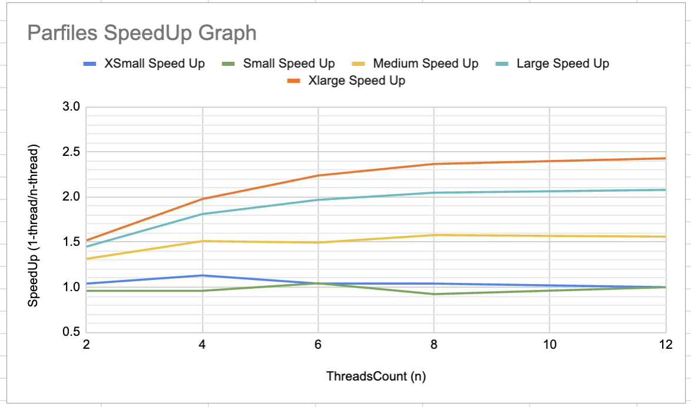

## Performance Analysis

[](https://github.com/mpcs-jh/project-2-Sinadalee/tree/main#part-7-performance-analysis)

-   A brief description of the project (i.e., an explanation what you implemented in feed.go, server.go, twitter.go. A paragraph or two recap will suffice.

### `feed.go`
- Is a queue to store twitter feed posts. It can Add, Remove, Contains, and create a List of posts.
- Use coarse grain RW lock on linkedlist queue.
- RWlock allows writer to write exclusively, while many reader can reads concurrently. It's implemented using mutex.

### `server.go`
- Read(decode) tasks and let the producer feeds requests to the queue. Ready consumers will grab the requests and produce responses (encode).
- If there's no task available, the consumers will be waiting with the condition variable (sema == 0).
- The condition variable is implemented using semaphore.
- The semaphor goes up when producer enque a task, signaling that at least one task is available.
- Any consmers that have been waiting for the semaphor number to go up (sema > 0) grab the tasks to do.
- Any free consumers with no task will be sleeping, waiting for the semaphor signal.
- We use semaphor rather than a mutex for synchronization because unlike mutex Semaphor has counter and no lock ownership. There're several consumers that have to hold locks and go to sleep, so should not have ownership.
- When producer received 'DONE' message. It signal every consumers to wake up, allowing every consumers to exit and the program to exit.

### `twitter.go`
- Create config from the user arguments.
	- set these config fields : Config.Mode = 'p' or 's', Config.ConsumersCount, ..
- Run `server.Run`

 ### Run Test Script
 - Test parallel and sequential run on xsmall, small , ... on {2 4 8 12} threads
 `cd proj2/benchmark`
 `sbatch benchmark.sh`

 - Tests Outputs
	 -  `benchmark/times/` folder records individual time x5 experiments.
	 - `benchmark/times/time_summary.txt` find the minimum time and saved here. I'll use this time to produce graph.

Example time_summary.txt :

```
     Record Test from go timer 
Sequential size: xsmall
Min Time: 0.24
Sequential size: small
Min Time: 0.23
```

- The time in the recording is measured from the timer in the file benchmark.go 
- See this spreadsheet for graph plotting [spreadsheet](https://docs.google.com/spreadsheets/d/1Ibo9yluHXg4a2B33aCUpcOrOfuy9z-64i4OcPWRgVmg/edit?usp=sharing) 



## Test Result Analysis

- SpeedUp = runtime n-thread / runtime sequential

**1. Graph Analysis**
- Rate of speed-up increases at higher margin with the bigger dataset.
- The smaller datasets plateau earlier as it hits the conversion point earlier. This is becuase the sequential programming portion or the bottleneck outperform the parallel programming's benefit.
	- ie. Sprawning more threads than tasks available.
	- or sprawn more threads than the speed that the queue can feed task. The atomic compare and swap in the lockfree queue might causes hotspot because many consumers want to deque at the same time.

 **2. What affect does the linked-list implementation have on performance? Does changing the implementation to a lock-free algorithm improve performance?**
- Linked list especially the coarse grain lock used in Feed has high bottleneck (hotspot). Every threads who want to do something on the queue needs to wait, especially if one thread takes especially long. There will be a traffic jam.
- Switch to Lock Free has benefits :
	- Ensure faster throughput and lower latency.
	- Contains doesn't need lock.
	- Enqueue and Dequeue can be done concurrently because it doesn't have to wait for the same lock. Rather, it uses atomic compare and swap at the head / tail.

**3. Ways to increase in performance if you were to use a different synchronization technique or improved queuing techniques.
Specifically, look at the RW lock, queue, and producer/consumer components and how they all might be affecting performance.
Explain why you would see potential improvements in performance based on either keeping these components are substituting them out for better algorithms.**

- RW lock : current implementation uses coarse grain RW lock. To improve, we can use fine grained such as optimistic RW lock  or lazy RW lock. This will reduce contention at the head node and thread can traverse without lock.
- queue : use lock-free or fine grained lock in feed queue will reduce queue bottleneck.
- producer/consumer components :
	- Current implementation allows producer to increase the semaphor lock as much as the tasks available. That is, producers are also enqueuing all the tasks they come across.
	- If producer is faster than consumer. The queue grows, older items are pushed out of the CPU cache. When the consumer finally gets to these tasks, they may no longer be in the cache, leading to cache misses. That thread will have to do I/O which slows down the performance. To improve, use bounded semaphor.
	- Sprawing more producers will improve throughput if consumers are faster.

4. Does the hardware have any affect on the performance of the benchmarks?
- Yes, CPU Performance :
	- Core counts : more cores can do more parallel tasks
	- Clock Speed : Higher clock speeds can process tasks faster
	- Cache Size : bigger cache reduces latency of memory access when cache hits and also reduce cache misses.
